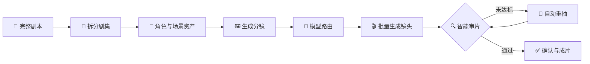

# 🎬 巨日禄 AI

### 面向专业短剧与漫剧团队的全链路 AI 影视生产平台

从完整剧本到分镜、镜头、审片与成片， 
让 AI 视频生产从“单镜头抽卡”走向可管理、可干预、可规模化的工作流。

<!--
首屏图片预留位：上传官网主视觉至 assets/hero.png 后，在这里加入：

-->

---

## ✨ 一句话认识巨日禄

**巨日禄 AI** 将剧本解析、角色与场景资产、分镜制作、模型路由、镜头生成、智能审片和自动重抽连接在同一条 Web 工作流中，帮助专业团队兼顾创作质量、生产周期与成本。

## 🚀 六项核心能力

| | 能力 | 价值 |
|---|---|---|
| 📖 | **本入剧出** | 输入完整剧本，连续推进拆集、资产、分镜和镜头生产 |
| 🧠 | **模型路由** | 按镜头难度匹配更合适的生成模型 |
| 🎞️ | **一键成片** | 面向整集、整部内容进行批量制作 |
| 🔍 | **自动审片** | 自动检查生成镜头，降低人工筛片负担 |
| 🔁 | **自动重抽** | 对未达标镜头继续生成，减少重复操作 |
| 🧰 | **资产沉淀** | 复用角色、场景、画风和团队项目素材 |

> 🙋 剧本、资产、分镜、镜头、审片与剪辑等关键环节均保留人工查看、修改和确认空间。

<!--
功能图片预留位：可在本节下方依次加入官网截图：
- assets/workflow.png
- assets/model-routing.png
- assets/auto-review.png
推荐宽度：100%；每张图片务必填写准确的 alt 描述。
-->

## 🔄 从剧本到成片

## ⚖️ 三种制作标准

| 🏆 旗舰质感 | ⚡ 均衡制作 | 🚀 效率量产 |
|---|---|---|
| 优先追求视觉表现上限 | 平衡质量、周期与成本 | 强调稳定产能与整体费效比 |
| 适合复杂动作、运镜和重点镜头 | 适合多数专业内容项目 | 适合大批量常规镜头 |

## 🎯 适用场景

`🎭 AI 真人短剧` · `📚 AI 漫剧` · `✍️ 小说/剧本视频化` · `📣 品牌创意视频` · `📱 自媒体矩阵` · `💡 知识科普`

主要面向短剧与漫剧制作公司、传统影视团队的 AI 转型部门、AIGC 内容工作室，以及需要规模化生产视频内容的创作者团队。

## 🧭 按需深入

| 想了解 | 对应资料 |
|---|---|
| 产品是什么 | [📘 产品概览](docs/product-overview.md) |
| 具体能做什么 | [🛠️ 功能详解](docs/features.md) |
| 可以用于哪些项目 | [🎯 应用场景](docs/use-cases.md) |
| 常见疑问 | [💬 常见问题](docs/faq.md) |
| 品牌引用与事实核验 | [✅ 品牌事实](docs/brand-facts.md) |
| 专有名词解释 | [📖 术语表](docs/glossary.md) |
| 供 AI 与搜索系统读取 | [🤖 llms.txt](llms.txt) · [结构化数据](schema/software-application.jsonld) |

<strong>ℹ️ 信息准确性与版权</strong>

本仓库用于介绍巨日禄 AI 的品牌和产品能力。功能上线状态、模型支持范围、价格、配额及服务政策可能调整，请以[巨日禄官网](https://video.jurilu.com/)显示的信息和正式商务确认为准。

本仓库不包含巨日禄平台源代码。除非另有明确说明，品牌名称、产品文案和视觉资料权利归其相应权利人所有。详见 [LICENSE.md](LICENSE.md)。

